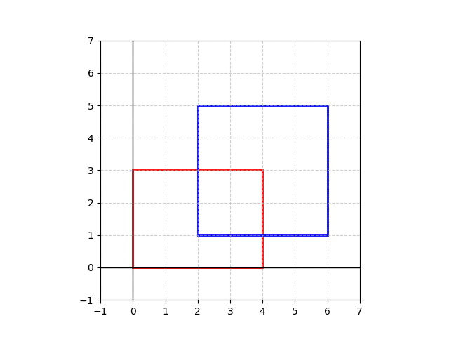
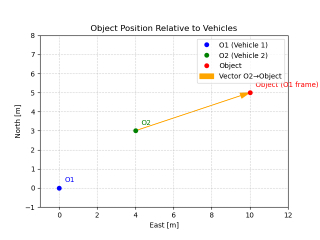
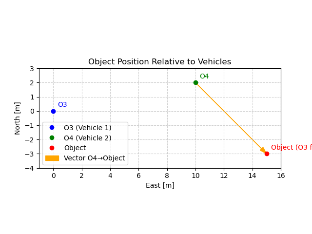

# Exercise 2

### 1. Bounding Box Definition

**Given:** 2D bounding box $(x_{\min},y_{\min},x_{\max},y_{\max})=(2,3,6,8)$.

**(a) Four corner coordinates (in order):**
- Bottom-left: $(2, 3)$
- Bottom-right: $(6, 3)$
- Top-left: $(2, 8)$
- Top-right: $(6, 8)$

**(b) Area of the bounding box**

Width $= x_{\max}-x_{\min} = 6-2 = 4$.

Height $= y_{\max}-y_{\min} = 8-3 = 5$.

Area $= 4 \times 5 = 20$ (square units).

---

### 2. Bounding Boxes and Occupied Space

**(a)** Given a 3D bounding box with parameters $(x,y,z,l,w,h,\Psi)=(5,3,0,4,2,2,45^\circ)$.

Volume: $V = l \cdot w \cdot h = 4 \times 2 \times 2 = 16$.

**(b)** Rotation by 45° does not change volume, but the occupied *axis-aligned footprint* changes.

**(c)** IoU of boxes:
- $B_1:(0,0,4,3)$, area=12.
- $B_2:(2,1,6,5)$, area=16.
- Intersection: area=4.
- Union: 12+16-4=24.
- IoU = 4/24 ≈ **0.1667**.

---

### 3. Confidence and Uncertainty

- Bicycle 0.65 confidence:
  - (a) Occluded by bus → Aleatoric.
    - The detector struggles because some parts of the bicycle are not visible due to occlusion. Even a perfect model would have limited evidence, because the input data itself is incomplete.
  - (b) Few bicycle examples in training → Epistemic.
    - Here the uncertainty is not about the input but about the model’s knowledge. The model has seen very few bicycles, so its internal representation is less reliable.

- Pedestrian 0.85 in fog → Aleatoric.
    - Fog reduces the clarity of sensor measurements, adding random noise and blurring features. This uncertainty is aleatoric, since it is caused by the environment.

- Object 0.40 confidence → reduce Epistemic uncertainty by:
  1. Collecting more representative training data.
  2. Using ensembling which capture uncertainty better by combining predictions from multiple models.

- Phantom detection 0.95 confidence → Confidence can be misleading, overconfident on artifacts. Safety-critical systems need calibration, sensor fusion, and consistency checks.

---

### 4. Coordinate Transformation

**(a)** Object at (10,5) in O1. O2 is (4,3) relative to O1.  
→ (6,2) in O2.

**(b)** Object (15,-3) in O3. O4 is (10,2) from O3.  
→ (5,-5) in O4.

**(c)** General transform (translation only):
$$
T =
\begin{bmatrix}
1 & 0 & -\Delta x \\
0 & 1 & -\Delta y \\
0 & 0 & 1
\end{bmatrix}
$$

**(d)** With rotation θ:  
Calculation with θ=30°, Δ=(10,2), p=(15,-3):  
Result ≈ (1.83, -6.83). (Done in [Script](scripts/matrix_transform.py))

---

### 5. Motion Vector Propagation (CTRV)

State: [0,0,20,30°,0], Δt=2s.  
Distance=40m.  
Δx=40·cos30°≈34.64, Δy=40·sin30°=20.  
New pos ≈ (34.64,20).  

---

### 6. Comparing Motion Models

- **CTRA** with a=2 m/s² → displacement=44m → pos ≈ (38.1,22).
- **CV** → same as CTRV with no yaw: (34.64,20).

---

### 7. Geopositioning and GNSS

**(a)** To convert WGS84 coordinates to UTM you need to identify the UTM zone based on longitudeand apply the UTM projection formulas to obtain Easting (X) and Northing (Y) in meters.

WGS84 (52.52°N,13.405°E) → UTM zone 33U (391779.259, 5820072.159).  

**(b)** GNSS error ±2m:
- (i) The absolute position uncertainty means that a vehicle could be anywhere within a 2 m radius of the reported coordinates. This could cause many problems for the operation of the vehicle.
- (ii) To calculate the relative error we have to calculate as deviation $\sqrt{2^2 + 2^2} \approx 2.83$m is the relative error.

**(c)** The relative cartesian coordiante system has the advantages of cheaper computations and more precision.

---

### 8. Time Derivatives in Rotating Reference Frames

**(a) IMU at the center of rotation**

- If the IMU is mounted at the vehicle’s center of rotation (CoR), it does not experience rotation effects.
- The longitudinal acceleration measured by the IMU is simply the derivative of forward velocity:

$$
a_\text{long} = \dot{v}_x
$$

- No extra terms are needed for yaw or rotation.

---

**(b) IMU displaced from the center of rotation**

- If the IMU is offset from the CoR by a vector $\mathbf{r}_\text{IMU} = [x_\text{IMU}, y_\text{IMU}]$, it experiences additional accelerations due to rotation:

1. Centripetal acceleration: points toward the rotation center, proportional to $\omega^2 r$.  
2. Tangential acceleration: due to yaw acceleration, proportional to $\dot{\omega} r$.

- The longitudinal acceleration measured at the IMU becomes:

$$
a_x^\text{IMU} = a_x^\text{CoR} - \omega^2 y_\text{IMU} + \dot{\omega} y_\text{IMU}
$$

- Similarly, the lateral acceleration is:

$$
a_y^\text{IMU} = a_y^\text{CoR} + \omega^2 x_\text{IMU} - \dot{\omega} x_\text{IMU}
$$